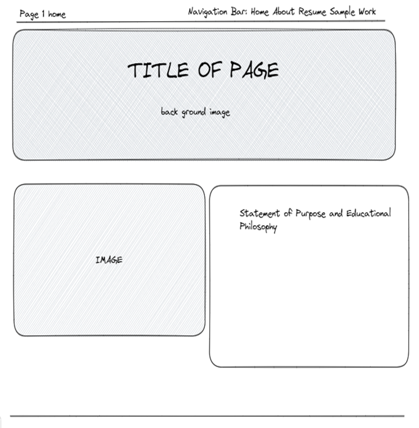
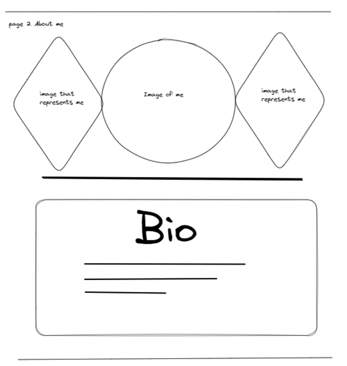
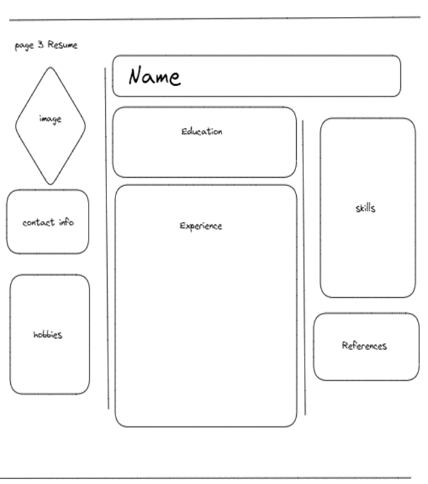
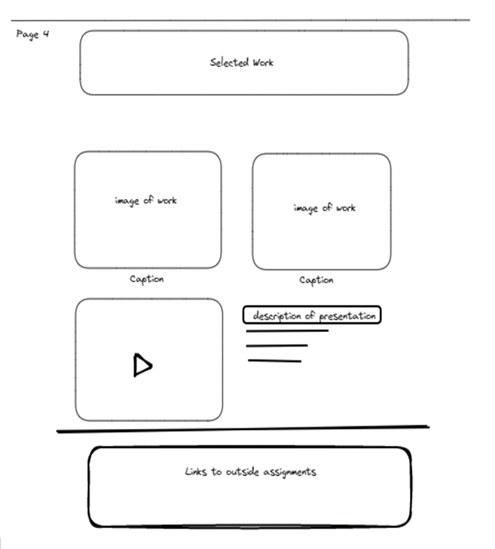

# Eleanor Francois' INF 6420 Project

A portfolio site showcasing my work.

## Wireframes 

I value planning so here are some wirefames to show how the site architecture and layout could possible be. 

### Landing Page

Header - will include the navigation bar 

Navigation Menu  - will have links to my landing, about me, resume, and my selected work pages.

Main Content - will include the title of the page, Eleanor R. Francois—a background image, and a picture of myself, which will also have my statement of purpose and educational philosophy. 

Footer - will include copyright information. 

### About Page

Header - will include the navigation bar 

Navigation Menu  - will have links to my landing, about me, resume, and my selected work pages.

Main Content - Will include a picture of myself and images that represent who I am. It will also have my biography to give potential readers more insight into who I am.

Footer - will include copyright information. 

### Resume Page

Header - will include the navigation bar 

Navigation Menu  - will have links to my landing, about me, resume, and my selected work pages.

Main Content - Will include a picture or logo. This page will consist of my name and experience, including contact information, skills, hobbies, and references

Footer - will include copyright information.

### Sample Work Page 

Header - will include the navigation bar 

Navigation Menu  - will have links to my landing, about me, resume, and my selected work pages.

Main Content - This page will contain samples of completed assignments such as video presentations, links to reports, and infographics completed throughout the INF program.

Footer - will include copyright information.
